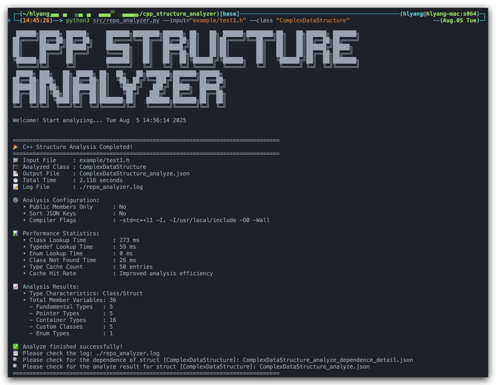

# C++ Structure Analyzer

A powerful tool for analyzing C/C++ code structures, providing detailed information about classes and structures with recursive analysis capabilities. This tool generates comprehensive JSON output for better understanding of complex code architectures.

Powered by [CastXML](https://github.com/CastXML/CastXML) and [pygccxml](https://github.com/gccxml/pygccxml).



## 🚀 Features

### 📊 Comprehensive Structure Analysis
- **Recursive Analysis**: Deep inspection of class/structure hierarchies
- **Member Variable Details**: Complete analysis including:
  - Variable types and names
  - Visibility (public, private, protected)
  - Pointer and reference detection
  - Const qualification analysis
  - Template parameter resolution
- **Container Support**: Analysis of STL containers like `std::vector`, `std::map`, etc.

### 📄 JSON Output Support
- **Structured Data**: Well-formatted JSON output for programmatic use
- **Caching System**: Efficient type analysis with intelligent caching
- **Detailed Metadata**: Rich information about each analyzed component

### 🎯 Advanced Type Support
- **Fundamental Types**: Complete C++ primitive type recognition
- **STL Containers**: Support for vectors, maps, sets, and other containers
- **Custom Types**: Analysis of user-defined classes and structures
- **Typedef Resolution**: Multi-level typedef unwrapping
- **Template Analysis**: Complex template parameter parsing

### 🔍 Smart Filtering
- **Visibility Control**: Option to analyze only public members
- **Path Blacklisting**: Exclude system libraries and third-party code
- **Namespace Support**: Handle complex namespace hierarchies

## 📋 Requirements

### System Dependencies
- **CastXML**: XML generator for C++ code analysis
- **Clang++**: C++ compiler (typically `/usr/bin/clang++`)
- **Python 3.5+**: Runtime environment

## 🛠️ Installation

### 1. Install CastXML

#### Method 1: Build from Source
```bash
git clone https://github.com/CastXML/CastXMLSuperbuild.git
```
Follow the instructions in the [CastXMLSuperbuild](https://github.com/CastXML/CastXMLSuperbuild) to build and install CastXML.

#### Method 2: By downloading Pre-built Binaries
Go to the [CastXML Releases](https://github.com/CastXML/CastXMLSuperbuild/releases) page and download the appropriate binary for your system. For example, for Linux:

```bash
# Download and install CastXML binary
wget xxx.tar.gz
tar -xzf castxml-linux.tar.gz
sudo cp castxml-linux/bin/castxml /usr/local/bin/
sudo chmod +x /usr/local/bin/castxml
sudo cp -r castxml-linux/share/castxml /usr/local/share/
```

### 2. Install Python Dependencies
```bash
python3 -m pip install pygccxml>=3.0.2
python3 -m pip install enum
python3 -m pip install funcy
```

### 3. Clone Repository
```bash
git clone https://github.com/hl-yang96/cpp_structure_analyzer.git
cd cpp_structure_analyzer
```

## 🚀 Usage

### Quick Start Example
```bash
cd cpp_structure_analyzer
python3 src/repo_analyzer.py --input="example/test1.h" --class "ComplexDataStructure"
```

### Command Line Interface
```bash
python src/repo_analyzer.py \
    --input /path/to/header.h \
    --class ClassName \
    --output result.json \
    --cflags "-std=c++17 -I/usr/local/include" \
    --sort_keys \
    --log_file ./analysis.log \
    --only_public_var \
    --file_path_black_list 3rd /usr /opt
```

### Parameters
- `--input`: Path to the C++ header file to analyze (default: "../../My_Repository.h")
- `--class`: Name of the class/struct to analyze (default: "MyClass")
- `--output`: Output JSON file path (default: "TODO.json", auto-generated as "{class}_analyze.json")
- `--cflags`: Compiler flags for clang++ (default: "-std=c++11 -I. -I/usr/local/include -O0 -Wall")
- `--sort_keys`: Sort JSON keys when dumping to file (flag, default: False)
- `--log_file`: Path to the log file (default: "./repo_analyzer.log")
- `--only_public_var`: Only analyze public variables of a class/struct (flag, default: False)
- `--file_path_black_list`: Blacklisted file paths to ignore (space-separated list, default: [])


## 📊 Output Format

The tool generates detailed JSON output with the following structure:

```json
{
    "type": "MyClass",
    "decl_type": "MyClass",
    "is_class": true,
    "variables": [
        {
            "name": "member_var",
            "decl_type": "int",
            "type": "int",
            "is_fundamental": true,
            "is_pointer": false
        },
        {
            "name": "named_paths",
            "type": "std::map<std::string, std::vector<Point3D>>",
            "decl_type": "std::map<std::string, std::vector<Point3D>>",
            "is_class": true,
            "is_container": true,
            "container_k_type": "std::string",
            "container_k": {
                "cache_k": "std::string",
                "cached": "Done",
                "decl_type": "std::string",
                "type": "std::string"
            },
            "container_v_type": "std::vector<Point3D>",
            "container_v": {
                "container_k_type": null,
                "container_v": {
                    "cache_k": "Point3D",
                    "cached": "Done",
                    "decl_type": "Point3D",
                    "type": "Point3D"
                },
                "container_v_type": "Point3D",
                "decl_type": "std::vector<Point3D>",
                "is_class": true,
                "is_container": true,
                "type": "std::vector<Point3D>"
            }
        },
    ]
}
```

### Key Fields
- `type`: Processed type name
- `decl_type`: Original declaration type
- `is_fundamental`: Boolean indicating primitive types
- `is_enum`: Boolean indicating enumeration types
- `is_pointer`: Boolean indicating pointer types
- `is_class`: Boolean indicating class/struct types
- `is_container`: Boolean indicating STL containers
- `variables`: Array of member variables (for classes)

## 🎨 Visualization (Planned Feature)

Future versions will include graph visualization capabilities:

- **Interactive Diagrams**: Web-based structure visualization
- **Dependency Graphs**: Show relationships between classes
- **Inheritance Trees**: Visual representation of class hierarchies
- **Export Options**: SVG, PNG, and interactive HTML formats

## 🤝 Contributing

We welcome contributions! 

## 📝 License

This project is licensed under the Apache 2.0 License - see the [LICENSE](LICENSE) file for details.

## 🐛 Issues and Support

- **Bug Reports**: [GitHub Issues](https://github.com/hl-yang96/cpp_structure_analyzer/issues)
- **Feature Requests**: [GitHub Discussions](https://github.com/hl-yang96/cpp_structure_analyzer/discussions)
- **Documentation**: [Wiki](https://github.com/hl-yang96/cpp_structure_analyzer/wiki)

## 🙏 Acknowledgments

- [pygccxml](https://github.com/gccxml/pygccxml) - Python bindings for GCC-XML
- [CastXML](https://github.com/CastXML/CastXML) - C++ XML generator
- [Clang](https://clang.llvm.org/) - C++ compiler infrastructure

---

**Made with ❤️ for C++ developers**
